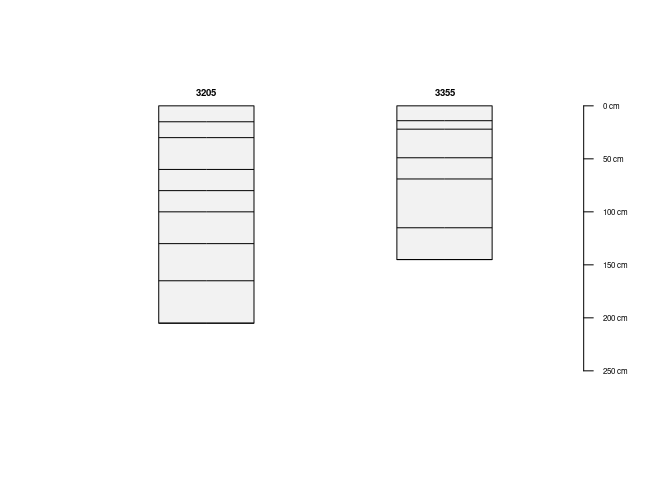

Ejemplos de uso
================
Elio Campitelli y Paola Corrales
16/05/2021

## Buscar datos disponibles

La función `buscar_perfiles()` permite buscar perfiles en función de la
localización, la fecha y la clase. La primera vez que se corre, descarga
el archivo <http://sisinta.inta.gob.ar/es/perfiles.geojson>.

Si se corre sin argumentos, devuelve todos los perfiles disponibles.

``` r
buscar_perfiles() %>% 
  head(10)
```

    ##    perfil_id    numero      fecha
    ## 1          1         1 1976-01-01
    ## 2          3  13/656 C 1967-03-17
    ## 3          4 13/1255 C 1969-10-24
    ## 4          6      37 C 1987-08-21
    ## 5          7     789 C 1900-01-01
    ## 6         18   6/207 C 1965-05-02
    ## 7         22      15 C 1990-01-01
    ## 8         28  9/1431 C 1969-09-20
    ## 9         38 23/1245 C 1989-06-01
    ## 10        46        46 1900-01-01
    ##                                                    clase       lon       lat
    ## 1          Natralbol típico, franca fina, mixta, térmica -61.85000 -34.17250
    ## 2                                       Natralbol típico -60.74271 -34.46339
    ## 3                       Argiacuol típico, fina, illítica -58.35011 -35.09693
    ## 4                         Hapludol éntico, franca gruesa -62.40742 -34.87200
    ## 5         Natracualf típico, limosa fina, mixta, térmica -62.20000 -34.10667
    ## 6               Argiudol típico, fina, illítica, térmica -59.42444 -33.83333
    ## 7                                       Natracuol dúrico -62.80778 -34.45722
    ## 8                                     Argiudol abrúptico -58.29163 -35.17931
    ## 9           Hapludol típico, franca fina, mixta, térmica -61.93083 -35.78833
    ## 10 Argiudol típico, limosa/arcillosa fina,mixta, térmica -61.55278 -33.82500

Técnicamente, también lista algunos perfiles que no están disponibles
públicamente:

``` r
buscar_perfiles() %>%
  filter(clase == "No disponible") %>% 
  head(10)
```

    ##    perfil_id    numero      fecha         clase       lon       lat
    ## 1         54      11-C 1900-01-01 No disponible -62.46667 -34.53750
    ## 2        202   1/803 C 1968-02-17 No disponible -60.78861 -33.02639
    ## 3        305 25/1269 C 1900-01-01 No disponible -59.25722 -38.42556
    ## 4        311   9-952-C 1967-08-22 No disponible -61.05556 -33.42778
    ## 5        363  13/861 C 1967-10-26 No disponible -60.20300 -33.45313
    ## 6        422   3 - 4 C 1965-06-11 No disponible -59.97324 -33.64536
    ## 7        423       423 1966-01-01 No disponible -61.51750 -32.61556
    ## 8        427       427 1966-01-01 No disponible -61.05556 -33.42778
    ## 9        538   9/275 C 1965-11-11 No disponible -59.65497 -34.03202
    ## 10       765    4/98 C 1965-11-26 No disponible -59.30128 -34.36846

La búsqueda por clase devuelve todos los perfiles que contienen alguno
de los términos a buscar. Por ejemplo, la siguiente búsqueda devuelve
los perfiles que contengan “hapludol” o “natralbol”.

``` r
buscar_perfiles(clase = c("hapludol", "natralbol")) %>% 
  head(10)
```

    ##    perfil_id    numero      fecha
    ## 1          1         1 1976-01-01
    ## 2          3  13/656 C 1967-03-17
    ## 4          6      37 C 1987-08-21
    ## 9         38 23/1245 C 1989-06-01
    ## 13        63      C-60 1990-11-08
    ## 18        75       2-C 1900-01-01
    ## 21        86 11/1039 C 1967-03-29
    ## 22        92      46-C 1900-01-01
    ## 23       107      01 C 1989-12-01
    ## 29       173     173 C 1900-01-01
    ##                                                   clase       lon       lat
    ## 1         Natralbol típico, franca fina, mixta, térmica -61.85000 -34.17250
    ## 2                                      Natralbol típico -60.74271 -34.46339
    ## 4                        Hapludol éntico, franca gruesa -62.40742 -34.87200
    ## 9          Hapludol típico, franca fina, mixta, térmica -61.93083 -35.78833
    ## 13                                      Hapludol éntico -63.28000 -35.62917
    ## 18                                      Hapludol éntico -62.12222 -34.22250
    ## 21        Natralbol típico, limosa fina, mixta, térmica -61.15417 -33.75278
    ## 22                               Hapludol thapto árgico -63.18889 -35.07639
    ## 23     Hapludol cumúlico, franca gruesa, mixta, térmica -63.38333 -35.56722
    ## 29 Hapludol thapto nátrico, limosa fina, mixta, térmica -62.05000 -33.82111

También se puede buscar for fechas. La siguiente búsqueda devuelve los
perfiles realizados durante 2019.

``` r
buscar_perfiles(rango_fecha = c("2019-01-01", "2019-12-31")) %>% 
  head(10)
```

    ##      perfil_id numero      fecha                      clase       lon       lat
    ## 4985      6347   6347 2019-08-21           Haplustol éntico -62.72870 -27.27495
    ## 4987      6349   6349 2019-08-22           Haplustol típico -62.66934 -27.29891
    ## 4999      6361   6361 2019-08-23           Haplustol éntico -62.62589 -27.30923
    ## 5167      6570   2728 2019-07-04         Albacultes típicos -56.57436 -28.56103
    ## 5170      6574   6574 2019-09-04   Kandihumultes oxiácuicos -56.44781 -28.42986
    ## 5171      6575   2731 2019-08-06        Epiacueptes aéricos -56.12493 -28.02513
    ## 5172      6576   2732 2019-09-05        Paleacultes aéricos -56.28889 -28.25750
    ## 5173      6577   2733 2019-08-06 Humacueptes fluvacuénticos -56.46022 -28.19897
    ## 5176      6580   2734 2019-06-11              Distrocreptes -55.71389 -28.38722
    ## 5177      6581   2735 2019-08-07        Epiacueptes aéricos -56.53306 -28.19444

La combinación de criterios de búsqueda devuelve los perfiles que
cumplen con ambos criterios. La siguiente búsqueda devuelve perfiles
obtenidos en 2019 y que tienen “hapludol” o “natralbol”.

``` r
buscar_perfiles(rango_fecha = c("2019-01-01", "2019-12-31"),
                clase = c("hapludol", "natralbol"))
```

    ##      perfil_id numero      fecha      clase       lon       lat
    ## 5213      6653   2811 2019-06-13 Hapludoles -55.73508 -28.33719

## Descarga de datos

Para descargar lo datos de los perfiles se usa la función
`get_perfiles()`. Ésta toma un vector con los ids de los perfiles a
descargar.

``` r
get_perfiles(c(6653, 6347, 6580)) %>% 
  .[, 1:5] %>% 
  head(10)
```

    ##    analitico_registro analitico_humedad analitico_s analitico_t
    ## 1               21711                NA        5.93       19.73
    ## 2               21712                NA        5.82       18.22
    ## 3                  NA                NA          NA          NA
    ## 4                  NA                NA          NA          NA
    ## 5                  NA                NA          NA       15.84
    ## 6                  NA                NA          NA       15.07
    ## 7                  NA                NA          NA       16.10
    ## 8                  NA                NA          NA          NA
    ## 9               21687                NA        1.49       20.89
    ## 10              21688                NA        1.24       18.34
    ##    analitico_ph_pasta
    ## 1                  NA
    ## 2                  NA
    ## 3                  NA
    ## 4                  NA
    ## 5                  NA
    ## 6                  NA
    ## 7                  NA
    ## 8                  NA
    ## 9                  NA
    ## 10                 NA

Alternativamente, puede tomar un data.frame que tenga una columna
llamada “perfil\_id”. Esto es así para que se pueda usar directamente la
salida de `buscar_perfiles()` para descargar los perfiles buscados.

``` r
buscar_perfiles(rango_fecha = c("2019-01-01", "2019-12-31"),
                clase = c("hapludol", "natralbol")) %>%
  get_perfiles() %>% 
  .[, 1:5] 
```

    ##   analitico_registro analitico_humedad analitico_s analitico_t
    ## 1              21711                NA        5.93       19.73
    ## 2              21712                NA        5.82       18.22
    ## 3                 NA                NA          NA          NA
    ##   analitico_ph_pasta
    ## 1                 NA
    ## 2                 NA
    ## 3                 NA

`get_perfiles()` por defecto descarga los datos en una carpeta temporal
de modo que si se vuelve a correr la misma línea de código no descarga
el o los perfil nuevamente.

``` r
# Primera llamada, tarda porque descarga los datos
system.time(get_perfiles(c(3238, 3182)))
```

    ##    user  system elapsed 
    ##   0.029   0.000   1.208

``` r
# Segunda llamada, levanta los datos de la carpeta temporal
system.time(get_perfiles(c(3238, 3182)))
```

    ##    user  system elapsed 
    ##   0.007   0.001   0.007

La carpeta de descarga se puede cambiar con el argumento `dir` de modo
que se puede cambiar a una carpeta permanente de datos dentro de un
proyecto. Para forzar la re-descarga de los datos, hay que setear el
argumento `refresh = TRUE`.

Algunos perfiles no se pueden descargar públicamente. Cuando pasa esto,
`get_perfiles()` devuelve un data.frame con los perfiles que sí se
pudieron descargar y un warning describiendo qué problemas
    hubo.

``` r
perfiles <- get_perfiles(c(3182, 4609))
```

    ## Warning in get_perfiles(c(3182, 4609)): No se pudieron descargar los siguientes perfiles:
    ##   * 4609 (#2). Razón: No estás autorizado para realizar esta acción

Para elevar este warning a un error, hay que setear el argumento
`parar_en_error` a `TRUE`. En este caso, la función va a tirar error al
primer perfil que no pueda
    descargar.

``` r
get_perfiles(c(3182, 4609), parar_en_error = TRUE)
```

    ## Error in FUN(X[[i]], ...): Error al descargar el perfil 4609 (#2). Razón: No estás autorizado para realizar esta acción

Para convertir los perfiles a un SoilProfileCollection se usa
`as_SoilProfileCollection()`. En este caso convertimos dos perfiles al
mismo tiempo.

``` r
get_perfiles(c(3355, 3205)) %>%
  as_SoilProfileCollection()
```

    ## converting profile IDs from integer to character

    ## SoilProfileCollection with 2 profiles and 14 horizons
    ## profile ID: perfil_id  |  horizon ID: hzID 
    ## Depth range: 145 - 205 cm
    ## 
    ## ----- Horizons (6 / 14 rows  |  10 / 63 columns) -----
    ##  perfil_id hzID profundidad_superior profundidad_inferior analitico_registro
    ##       3205    1                    0                   15                 NA
    ##       3205    2                   15                   30                 NA
    ##       3205    3                   30                   60                 NA
    ##       3205    4                   60                   80                 NA
    ##       3205    5                   80                  100                 NA
    ##       3205    6                  100                  130                 NA
    ##  analitico_humedad analitico_s analitico_t analitico_ph_pasta analitico_ph_h2o
    ##                 NA        16.2        22.1                5.6              5.9
    ##                 NA         9.7        13.7                6.1              6.4
    ##                 NA        19.6        21.9                6.6              7.0
    ##                 NA        23.2        24.1                6.9              7.2
    ##                 NA        22.3        23.1                7.4              7.8
    ##                 NA        18.1        19.1                7.5              7.9
    ## [... more horizons ...]
    ## 
    ## ----- Sites (2 / 2 rows  |  10 / 44 columns) -----
    ##  perfil_id perfil_numero perfil_profundidad_napa perfil_cobertura_vegetal
    ##       3205           CAO                      NA                       NA
    ##       3355          3355                     175                       NA
    ##  perfil_material_original perfil_modal perfil_fecha
    ##                        NA        modal   0001-01-01
    ##                        NA        modal   0001-01-01
    ##  perfil_vegetacion_o_cultivos perfil_observaciones perfil_publico
    ##                            NA                   NA           true
    ##                            NA                   NA           true
    ## 
    ## Spatial Data:
    ## [EMPTY]

Utilizando la librería {aqp}, se pueden plotear los perfiles.

``` r
library(aqp)
get_perfiles(c(3355, 3205)) %>%
  as_SoilProfileCollection() %>%
  plot()
```

<!-- -->

## Horizontes estandarizados

La función `interpolar_perfiles()` permite transformar el perfil en
horizontes estandarizados utilizando (por ahora) promedios ponderados.
El argumento `variables` recibe un vector con las variables a
estandarizar y por defecto genera horizontes cada 30 centrímetros.

``` r
get_perfiles(c(3238, 4634)) %>% 
  interpolar_perfiles(variables = c("analitico_s", "analitico_t"))
```

    ##    perfil_id profundidad_superior profundidad_inferior analitico_s analitico_t
    ## 1       3238                    0                   30    12.40000    14.40000
    ## 2       3238                   30                   60    20.04000    22.10000
    ## 3       3238                   60                   90    23.10000    25.50000
    ## 4       3238                   90                  120    20.41000    21.82000
    ## 5       3238                  120                  150          NA          NA
    ## 6       4634                    0                   30    23.45333    20.64000
    ## 7       4634                   30                   60    36.32667    21.66667
    ## 8       4634                   60                   90    46.50000    28.20000
    ## 9       4634                   90                  120    46.50000    28.20000
    ## 10      4634                  120                  150    46.50000    28.20000
    ##    perfil_numero perfil_profundidad_napa perfil_cobertura_vegetal
    ## 1           3238                      NA                       NA
    ## 2           3238                      NA                       NA
    ## 3           3238                      NA                       NA
    ## 4           3238                      NA                       NA
    ## 5           3238                      NA                       NA
    ## 6           4634                      NA                       NA
    ## 7           4634                      NA                       NA
    ## 8           4634                      NA                       NA
    ## 9           4634                      NA                       NA
    ## 10          4634                      NA                       NA
    ##    perfil_material_original perfil_modal perfil_fecha
    ## 1                      <NA>        modal   0001-01-01
    ## 2                      <NA>        modal   0001-01-01
    ## 3                      <NA>        modal   0001-01-01
    ## 4                      <NA>        modal   0001-01-01
    ## 5                      <NA>        modal   0001-01-01
    ## 6                      Loes        modal   0001-01-01
    ## 7                      Loes        modal   0001-01-01
    ## 8                      Loes        modal   0001-01-01
    ## 9                      Loes        modal   0001-01-01
    ## 10                     Loes        modal   0001-01-01
    ##    perfil_vegetacion_o_cultivos
    ## 1                          <NA>
    ## 2                          <NA>
    ## 3                          <NA>
    ## 4                          <NA>
    ## 5                          <NA>
    ## 6  Bosque bajo abierto (ralera)
    ## 7  Bosque bajo abierto (ralera)
    ## 8  Bosque bajo abierto (ralera)
    ## 9  Bosque bajo abierto (ralera)
    ## 10 Bosque bajo abierto (ralera)
    ##                                                                                                                                                                       perfil_observaciones
    ## 1                                                                                                                                                                                     <NA>
    ## 2                                                                                                                                                                                     <NA>
    ## 3                                                                                                                                                                                     <NA>
    ## 4                                                                                                                                                                                     <NA>
    ## 5                                                                                                                                                                                     <NA>
    ## 6  Coordenadas tomadas del libro: Compactaciones naturales y antrópicas en Suelos Argentinos. Capítulo 2: Fragipanes en la provincia del Chaco: identifcación, propiedades y distribución.
    ## 7  Coordenadas tomadas del libro: Compactaciones naturales y antrópicas en Suelos Argentinos. Capítulo 2: Fragipanes en la provincia del Chaco: identifcación, propiedades y distribución.
    ## 8  Coordenadas tomadas del libro: Compactaciones naturales y antrópicas en Suelos Argentinos. Capítulo 2: Fragipanes en la provincia del Chaco: identifcación, propiedades y distribución.
    ## 9  Coordenadas tomadas del libro: Compactaciones naturales y antrópicas en Suelos Argentinos. Capítulo 2: Fragipanes en la provincia del Chaco: identifcación, propiedades y distribución.
    ## 10 Coordenadas tomadas del libro: Compactaciones naturales y antrópicas en Suelos Argentinos. Capítulo 2: Fragipanes en la provincia del Chaco: identifcación, propiedades y distribución.
    ##    perfil_publico perfil_capacidad_subclases perfil_capacidad_clase
    ## 1            true                       <NA>                   <NA>
    ## 2            true                       <NA>                   <NA>
    ## 3            true                       <NA>                   <NA>
    ## 4            true                       <NA>                   <NA>
    ## 5            true                       <NA>                   <NA>
    ## 6            true                         es                     VI
    ## 7            true                         es                     VI
    ## 8            true                         es                     VI
    ## 9            true                         es                     VI
    ## 10           true                         es                     VI
    ##     perfil_ubicacion_descripcion perfil_ubicacion_recorrido
    ## 1                           <NA>                         NA
    ## 2                           <NA>                         NA
    ## 3                           <NA>                         NA
    ## 4                           <NA>                         NA
    ## 5                           <NA>                         NA
    ## 6  Departamento Chacabuco. Chaco                         NA
    ## 7  Departamento Chacabuco. Chaco                         NA
    ## 8  Departamento Chacabuco. Chaco                         NA
    ## 9  Departamento Chacabuco. Chaco                         NA
    ## 10 Departamento Chacabuco. Chaco                         NA
    ##    perfil_ubicacion_mosaico perfil_ubicacion_aerofoto perfil_ubicacion_latitud
    ## 1                        NA                        NA                -31.98333
    ## 2                        NA                        NA                -31.98333
    ## 3                        NA                        NA                -31.98333
    ## 4                        NA                        NA                -31.98333
    ## 5                        NA                        NA                -31.98333
    ## 6                        NA                        NA                -27.13803
    ## 7                        NA                        NA                -27.13803
    ## 8                        NA                        NA                -27.13803
    ## 9                        NA                        NA                -27.13803
    ## 10                       NA                        NA                -27.13803
    ##    perfil_ubicacion_longitud perfil_paisaje_tipo perfil_paisaje_forma
    ## 1                  -61.00083                  NA                   NA
    ## 2                  -61.00083                  NA                   NA
    ## 3                  -61.00083                  NA                   NA
    ## 4                  -61.00083                  NA                   NA
    ## 5                  -61.00083                  NA                   NA
    ## 6                  -61.47845                  NA                   NA
    ## 7                  -61.47845                  NA                   NA
    ## 8                  -61.47845                  NA                   NA
    ## 9                  -61.47845                  NA                   NA
    ## 10                 -61.47845                  NA                   NA
    ##    perfil_paisaje_simbolo perfil_humedad_subclases perfil_humedad_clase
    ## 1                      NA                       NA                   NA
    ## 2                      NA                       NA                   NA
    ## 3                      NA                       NA                   NA
    ## 4                      NA                       NA                   NA
    ## 5                      NA                       NA                   NA
    ## 6                      NA                       NA                   NA
    ## 7                      NA                       NA                   NA
    ## 8                      NA                       NA                   NA
    ## 9                      NA                       NA                   NA
    ## 10                     NA                       NA                   NA
    ##    perfil_erosion_clase perfil_erosion_subclase perfil_pedregosidad_clase
    ## 1                  <NA>                    <NA>                        NA
    ## 2                  <NA>                    <NA>                        NA
    ## 3                  <NA>                    <NA>                        NA
    ## 4                  <NA>                    <NA>                        NA
    ## 5                  <NA>                    <NA>                        NA
    ## 6              moderada                 hídrica                        NA
    ## 7              moderada                 hídrica                        NA
    ## 8              moderada                 hídrica                        NA
    ## 9              moderada                 hídrica                        NA
    ## 10             moderada                 hídrica                        NA
    ##    perfil_pedregosidad_subclase perfil_serie_nombre perfil_serie_simbolo
    ## 1                            NA             Arocena                  ARO
    ## 2                            NA             Arocena                  ARO
    ## 3                            NA             Arocena                  ARO
    ## 4                            NA             Arocena                  ARO
    ## 5                            NA             Arocena                  ARO
    ## 6                            NA     Doce de Octubre                   Df
    ## 7                            NA     Doce de Octubre                   Df
    ## 8                            NA     Doce de Octubre                   Df
    ## 9                            NA     Doce de Octubre                   Df
    ## 10                           NA     Doce de Octubre                   Df
    ##    perfil_serie_descripcion perfil_serie_provincia perfil_grupo_codigo
    ## 1                        NA               Santa Fe                  NA
    ## 2                        NA               Santa Fe                  NA
    ## 3                        NA               Santa Fe                  NA
    ## 4                        NA               Santa Fe                  NA
    ## 5                        NA               Santa Fe                  NA
    ## 6                        NA                  Chaco                  NA
    ## 7                        NA                  Chaco                  NA
    ## 8                        NA                  Chaco                  NA
    ## 9                        NA                  Chaco                  NA
    ## 10                       NA                  Chaco                  NA
    ##           perfil_grupo_descripcion perfil_fase_codigo perfil_fase_nombre
    ## 1  Argiudol típico, arcillosa fina                 NA                 NA
    ## 2  Argiudol típico, arcillosa fina                 NA                 NA
    ## 3  Argiudol típico, arcillosa fina                 NA                 NA
    ## 4  Argiudol típico, arcillosa fina                 NA                 NA
    ## 5  Argiudol típico, arcillosa fina                 NA                 NA
    ## 6                Natrustalf ácuico                 NA                 NA
    ## 7                Natrustalf ácuico                 NA                 NA
    ## 8                Natrustalf ácuico                 NA                 NA
    ## 9                Natrustalf ácuico                 NA                 NA
    ## 10               Natrustalf ácuico                 NA                 NA
    ##    perfil_sales perfil_uso_de_la_tierra perfil_relieve perfil_permeabilidad
    ## 1            NA                    <NA>           <NA>                 <NA>
    ## 2            NA                    <NA>           <NA>                 <NA>
    ## 3            NA                    <NA>           <NA>                 <NA>
    ## 4            NA                    <NA>           <NA>                 <NA>
    ## 5            NA                    <NA>           <NA>                 <NA>
    ## 6            NA                ganadero      subnormal  moderadamente lenta
    ## 7            NA                ganadero      subnormal  moderadamente lenta
    ## 8            NA                ganadero      subnormal  moderadamente lenta
    ## 9            NA                ganadero      subnormal  moderadamente lenta
    ## 10           NA                ganadero      subnormal  moderadamente lenta
    ##    perfil_escurrimiento perfil_pendiente perfil_anegamiento perfil_drenaje
    ## 1                    NA               NA               <NA>        clase 4
    ## 2                    NA               NA               <NA>        clase 4
    ## 3                    NA               NA               <NA>        clase 4
    ## 4                    NA               NA               <NA>        clase 4
    ## 5                    NA               NA               <NA>        clase 4
    ## 6                    NA               NA            clase 2        clase 3
    ## 7                    NA               NA            clase 2        clase 3
    ## 8                    NA               NA            clase 2        clase 3
    ## 9                    NA               NA            clase 2        clase 3
    ## 10                   NA               NA            clase 2        clase 3
    ##    perfil_posicion
    ## 1             <NA>
    ## 2             <NA>
    ## 3             <NA>
    ## 4             <NA>
    ## 5             <NA>
    ## 6          tendido
    ## 7          tendido
    ## 8          tendido
    ## 9          tendido
    ## 10         tendido

También es posible definir los horizontes estandarizados utilizando el
argumento `horizontes`, por ejemplo de 0 a 100, cada 10 centímetros.

``` r
get_perfiles(c(3238, 4634)) %>% 
  interpolar_perfiles(variables = c("analitico_s", "analitico_t"),
                      horizontes = seq(0, 100, 10))
```

    ##    perfil_id profundidad_superior profundidad_inferior analitico_s analitico_t
    ## 1       3238                    0                   10       12.40       14.40
    ## 2       3238                   10                   20       12.40       14.40
    ## 3       3238                   20                   30       12.40       14.40
    ## 4       3238                   30                   40       13.80       15.50
    ## 5       3238                   40                   50       22.12       24.30
    ## 6       3238                   50                   60       24.20       26.50
    ## 7       3238                   60                   70       24.20       26.50
    ## 8       3238                   70                   80       23.10       25.50
    ## 9       3238                   80                   90       22.00       24.50
    ## 10      3238                   90                  100       21.32       23.26
    ## 11      4634                    0                   10       18.92       19.52
    ## 12      4634                   10                   20       20.40       21.20
    ## 13      4634                   20                   30       31.04       21.20
    ## 14      4634                   30                   40       35.60       21.20
    ## 15      4634                   40                   50       35.60       21.20
    ## 16      4634                   50                   60       37.78       22.60
    ## 17      4634                   60                   70       46.50       28.20
    ## 18      4634                   70                   80       46.50       28.20
    ## 19      4634                   80                   90       46.50       28.20
    ## 20      4634                   90                  100       46.50       28.20
    ##    perfil_numero perfil_profundidad_napa perfil_cobertura_vegetal
    ## 1           3238                      NA                       NA
    ## 2           3238                      NA                       NA
    ## 3           3238                      NA                       NA
    ## 4           3238                      NA                       NA
    ## 5           3238                      NA                       NA
    ## 6           3238                      NA                       NA
    ## 7           3238                      NA                       NA
    ## 8           3238                      NA                       NA
    ## 9           3238                      NA                       NA
    ## 10          3238                      NA                       NA
    ## 11          4634                      NA                       NA
    ## 12          4634                      NA                       NA
    ## 13          4634                      NA                       NA
    ## 14          4634                      NA                       NA
    ## 15          4634                      NA                       NA
    ## 16          4634                      NA                       NA
    ## 17          4634                      NA                       NA
    ## 18          4634                      NA                       NA
    ## 19          4634                      NA                       NA
    ## 20          4634                      NA                       NA
    ##    perfil_material_original perfil_modal perfil_fecha
    ## 1                      <NA>        modal   0001-01-01
    ## 2                      <NA>        modal   0001-01-01
    ## 3                      <NA>        modal   0001-01-01
    ## 4                      <NA>        modal   0001-01-01
    ## 5                      <NA>        modal   0001-01-01
    ## 6                      <NA>        modal   0001-01-01
    ## 7                      <NA>        modal   0001-01-01
    ## 8                      <NA>        modal   0001-01-01
    ## 9                      <NA>        modal   0001-01-01
    ## 10                     <NA>        modal   0001-01-01
    ## 11                     Loes        modal   0001-01-01
    ## 12                     Loes        modal   0001-01-01
    ## 13                     Loes        modal   0001-01-01
    ## 14                     Loes        modal   0001-01-01
    ## 15                     Loes        modal   0001-01-01
    ## 16                     Loes        modal   0001-01-01
    ## 17                     Loes        modal   0001-01-01
    ## 18                     Loes        modal   0001-01-01
    ## 19                     Loes        modal   0001-01-01
    ## 20                     Loes        modal   0001-01-01
    ##    perfil_vegetacion_o_cultivos
    ## 1                          <NA>
    ## 2                          <NA>
    ## 3                          <NA>
    ## 4                          <NA>
    ## 5                          <NA>
    ## 6                          <NA>
    ## 7                          <NA>
    ## 8                          <NA>
    ## 9                          <NA>
    ## 10                         <NA>
    ## 11 Bosque bajo abierto (ralera)
    ## 12 Bosque bajo abierto (ralera)
    ## 13 Bosque bajo abierto (ralera)
    ## 14 Bosque bajo abierto (ralera)
    ## 15 Bosque bajo abierto (ralera)
    ## 16 Bosque bajo abierto (ralera)
    ## 17 Bosque bajo abierto (ralera)
    ## 18 Bosque bajo abierto (ralera)
    ## 19 Bosque bajo abierto (ralera)
    ## 20 Bosque bajo abierto (ralera)
    ##                                                                                                                                                                       perfil_observaciones
    ## 1                                                                                                                                                                                     <NA>
    ## 2                                                                                                                                                                                     <NA>
    ## 3                                                                                                                                                                                     <NA>
    ## 4                                                                                                                                                                                     <NA>
    ## 5                                                                                                                                                                                     <NA>
    ## 6                                                                                                                                                                                     <NA>
    ## 7                                                                                                                                                                                     <NA>
    ## 8                                                                                                                                                                                     <NA>
    ## 9                                                                                                                                                                                     <NA>
    ## 10                                                                                                                                                                                    <NA>
    ## 11 Coordenadas tomadas del libro: Compactaciones naturales y antrópicas en Suelos Argentinos. Capítulo 2: Fragipanes en la provincia del Chaco: identifcación, propiedades y distribución.
    ## 12 Coordenadas tomadas del libro: Compactaciones naturales y antrópicas en Suelos Argentinos. Capítulo 2: Fragipanes en la provincia del Chaco: identifcación, propiedades y distribución.
    ## 13 Coordenadas tomadas del libro: Compactaciones naturales y antrópicas en Suelos Argentinos. Capítulo 2: Fragipanes en la provincia del Chaco: identifcación, propiedades y distribución.
    ## 14 Coordenadas tomadas del libro: Compactaciones naturales y antrópicas en Suelos Argentinos. Capítulo 2: Fragipanes en la provincia del Chaco: identifcación, propiedades y distribución.
    ## 15 Coordenadas tomadas del libro: Compactaciones naturales y antrópicas en Suelos Argentinos. Capítulo 2: Fragipanes en la provincia del Chaco: identifcación, propiedades y distribución.
    ## 16 Coordenadas tomadas del libro: Compactaciones naturales y antrópicas en Suelos Argentinos. Capítulo 2: Fragipanes en la provincia del Chaco: identifcación, propiedades y distribución.
    ## 17 Coordenadas tomadas del libro: Compactaciones naturales y antrópicas en Suelos Argentinos. Capítulo 2: Fragipanes en la provincia del Chaco: identifcación, propiedades y distribución.
    ## 18 Coordenadas tomadas del libro: Compactaciones naturales y antrópicas en Suelos Argentinos. Capítulo 2: Fragipanes en la provincia del Chaco: identifcación, propiedades y distribución.
    ## 19 Coordenadas tomadas del libro: Compactaciones naturales y antrópicas en Suelos Argentinos. Capítulo 2: Fragipanes en la provincia del Chaco: identifcación, propiedades y distribución.
    ## 20 Coordenadas tomadas del libro: Compactaciones naturales y antrópicas en Suelos Argentinos. Capítulo 2: Fragipanes en la provincia del Chaco: identifcación, propiedades y distribución.
    ##    perfil_publico perfil_capacidad_subclases perfil_capacidad_clase
    ## 1            true                       <NA>                   <NA>
    ## 2            true                       <NA>                   <NA>
    ## 3            true                       <NA>                   <NA>
    ## 4            true                       <NA>                   <NA>
    ## 5            true                       <NA>                   <NA>
    ## 6            true                       <NA>                   <NA>
    ## 7            true                       <NA>                   <NA>
    ## 8            true                       <NA>                   <NA>
    ## 9            true                       <NA>                   <NA>
    ## 10           true                       <NA>                   <NA>
    ## 11           true                         es                     VI
    ## 12           true                         es                     VI
    ## 13           true                         es                     VI
    ## 14           true                         es                     VI
    ## 15           true                         es                     VI
    ## 16           true                         es                     VI
    ## 17           true                         es                     VI
    ## 18           true                         es                     VI
    ## 19           true                         es                     VI
    ## 20           true                         es                     VI
    ##     perfil_ubicacion_descripcion perfil_ubicacion_recorrido
    ## 1                           <NA>                         NA
    ## 2                           <NA>                         NA
    ## 3                           <NA>                         NA
    ## 4                           <NA>                         NA
    ## 5                           <NA>                         NA
    ## 6                           <NA>                         NA
    ## 7                           <NA>                         NA
    ## 8                           <NA>                         NA
    ## 9                           <NA>                         NA
    ## 10                          <NA>                         NA
    ## 11 Departamento Chacabuco. Chaco                         NA
    ## 12 Departamento Chacabuco. Chaco                         NA
    ## 13 Departamento Chacabuco. Chaco                         NA
    ## 14 Departamento Chacabuco. Chaco                         NA
    ## 15 Departamento Chacabuco. Chaco                         NA
    ## 16 Departamento Chacabuco. Chaco                         NA
    ## 17 Departamento Chacabuco. Chaco                         NA
    ## 18 Departamento Chacabuco. Chaco                         NA
    ## 19 Departamento Chacabuco. Chaco                         NA
    ## 20 Departamento Chacabuco. Chaco                         NA
    ##    perfil_ubicacion_mosaico perfil_ubicacion_aerofoto perfil_ubicacion_latitud
    ## 1                        NA                        NA                -31.98333
    ## 2                        NA                        NA                -31.98333
    ## 3                        NA                        NA                -31.98333
    ## 4                        NA                        NA                -31.98333
    ## 5                        NA                        NA                -31.98333
    ## 6                        NA                        NA                -31.98333
    ## 7                        NA                        NA                -31.98333
    ## 8                        NA                        NA                -31.98333
    ## 9                        NA                        NA                -31.98333
    ## 10                       NA                        NA                -31.98333
    ## 11                       NA                        NA                -27.13803
    ## 12                       NA                        NA                -27.13803
    ## 13                       NA                        NA                -27.13803
    ## 14                       NA                        NA                -27.13803
    ## 15                       NA                        NA                -27.13803
    ## 16                       NA                        NA                -27.13803
    ## 17                       NA                        NA                -27.13803
    ## 18                       NA                        NA                -27.13803
    ## 19                       NA                        NA                -27.13803
    ## 20                       NA                        NA                -27.13803
    ##    perfil_ubicacion_longitud perfil_paisaje_tipo perfil_paisaje_forma
    ## 1                  -61.00083                  NA                   NA
    ## 2                  -61.00083                  NA                   NA
    ## 3                  -61.00083                  NA                   NA
    ## 4                  -61.00083                  NA                   NA
    ## 5                  -61.00083                  NA                   NA
    ## 6                  -61.00083                  NA                   NA
    ## 7                  -61.00083                  NA                   NA
    ## 8                  -61.00083                  NA                   NA
    ## 9                  -61.00083                  NA                   NA
    ## 10                 -61.00083                  NA                   NA
    ## 11                 -61.47845                  NA                   NA
    ## 12                 -61.47845                  NA                   NA
    ## 13                 -61.47845                  NA                   NA
    ## 14                 -61.47845                  NA                   NA
    ## 15                 -61.47845                  NA                   NA
    ## 16                 -61.47845                  NA                   NA
    ## 17                 -61.47845                  NA                   NA
    ## 18                 -61.47845                  NA                   NA
    ## 19                 -61.47845                  NA                   NA
    ## 20                 -61.47845                  NA                   NA
    ##    perfil_paisaje_simbolo perfil_humedad_subclases perfil_humedad_clase
    ## 1                      NA                       NA                   NA
    ## 2                      NA                       NA                   NA
    ## 3                      NA                       NA                   NA
    ## 4                      NA                       NA                   NA
    ## 5                      NA                       NA                   NA
    ## 6                      NA                       NA                   NA
    ## 7                      NA                       NA                   NA
    ## 8                      NA                       NA                   NA
    ## 9                      NA                       NA                   NA
    ## 10                     NA                       NA                   NA
    ## 11                     NA                       NA                   NA
    ## 12                     NA                       NA                   NA
    ## 13                     NA                       NA                   NA
    ## 14                     NA                       NA                   NA
    ## 15                     NA                       NA                   NA
    ## 16                     NA                       NA                   NA
    ## 17                     NA                       NA                   NA
    ## 18                     NA                       NA                   NA
    ## 19                     NA                       NA                   NA
    ## 20                     NA                       NA                   NA
    ##    perfil_erosion_clase perfil_erosion_subclase perfil_pedregosidad_clase
    ## 1                  <NA>                    <NA>                        NA
    ## 2                  <NA>                    <NA>                        NA
    ## 3                  <NA>                    <NA>                        NA
    ## 4                  <NA>                    <NA>                        NA
    ## 5                  <NA>                    <NA>                        NA
    ## 6                  <NA>                    <NA>                        NA
    ## 7                  <NA>                    <NA>                        NA
    ## 8                  <NA>                    <NA>                        NA
    ## 9                  <NA>                    <NA>                        NA
    ## 10                 <NA>                    <NA>                        NA
    ## 11             moderada                 hídrica                        NA
    ## 12             moderada                 hídrica                        NA
    ## 13             moderada                 hídrica                        NA
    ## 14             moderada                 hídrica                        NA
    ## 15             moderada                 hídrica                        NA
    ## 16             moderada                 hídrica                        NA
    ## 17             moderada                 hídrica                        NA
    ## 18             moderada                 hídrica                        NA
    ## 19             moderada                 hídrica                        NA
    ## 20             moderada                 hídrica                        NA
    ##    perfil_pedregosidad_subclase perfil_serie_nombre perfil_serie_simbolo
    ## 1                            NA             Arocena                  ARO
    ## 2                            NA             Arocena                  ARO
    ## 3                            NA             Arocena                  ARO
    ## 4                            NA             Arocena                  ARO
    ## 5                            NA             Arocena                  ARO
    ## 6                            NA             Arocena                  ARO
    ## 7                            NA             Arocena                  ARO
    ## 8                            NA             Arocena                  ARO
    ## 9                            NA             Arocena                  ARO
    ## 10                           NA             Arocena                  ARO
    ## 11                           NA     Doce de Octubre                   Df
    ## 12                           NA     Doce de Octubre                   Df
    ## 13                           NA     Doce de Octubre                   Df
    ## 14                           NA     Doce de Octubre                   Df
    ## 15                           NA     Doce de Octubre                   Df
    ## 16                           NA     Doce de Octubre                   Df
    ## 17                           NA     Doce de Octubre                   Df
    ## 18                           NA     Doce de Octubre                   Df
    ## 19                           NA     Doce de Octubre                   Df
    ## 20                           NA     Doce de Octubre                   Df
    ##    perfil_serie_descripcion perfil_serie_provincia perfil_grupo_codigo
    ## 1                        NA               Santa Fe                  NA
    ## 2                        NA               Santa Fe                  NA
    ## 3                        NA               Santa Fe                  NA
    ## 4                        NA               Santa Fe                  NA
    ## 5                        NA               Santa Fe                  NA
    ## 6                        NA               Santa Fe                  NA
    ## 7                        NA               Santa Fe                  NA
    ## 8                        NA               Santa Fe                  NA
    ## 9                        NA               Santa Fe                  NA
    ## 10                       NA               Santa Fe                  NA
    ## 11                       NA                  Chaco                  NA
    ## 12                       NA                  Chaco                  NA
    ## 13                       NA                  Chaco                  NA
    ## 14                       NA                  Chaco                  NA
    ## 15                       NA                  Chaco                  NA
    ## 16                       NA                  Chaco                  NA
    ## 17                       NA                  Chaco                  NA
    ## 18                       NA                  Chaco                  NA
    ## 19                       NA                  Chaco                  NA
    ## 20                       NA                  Chaco                  NA
    ##           perfil_grupo_descripcion perfil_fase_codigo perfil_fase_nombre
    ## 1  Argiudol típico, arcillosa fina                 NA                 NA
    ## 2  Argiudol típico, arcillosa fina                 NA                 NA
    ## 3  Argiudol típico, arcillosa fina                 NA                 NA
    ## 4  Argiudol típico, arcillosa fina                 NA                 NA
    ## 5  Argiudol típico, arcillosa fina                 NA                 NA
    ## 6  Argiudol típico, arcillosa fina                 NA                 NA
    ## 7  Argiudol típico, arcillosa fina                 NA                 NA
    ## 8  Argiudol típico, arcillosa fina                 NA                 NA
    ## 9  Argiudol típico, arcillosa fina                 NA                 NA
    ## 10 Argiudol típico, arcillosa fina                 NA                 NA
    ## 11               Natrustalf ácuico                 NA                 NA
    ## 12               Natrustalf ácuico                 NA                 NA
    ## 13               Natrustalf ácuico                 NA                 NA
    ## 14               Natrustalf ácuico                 NA                 NA
    ## 15               Natrustalf ácuico                 NA                 NA
    ## 16               Natrustalf ácuico                 NA                 NA
    ## 17               Natrustalf ácuico                 NA                 NA
    ## 18               Natrustalf ácuico                 NA                 NA
    ## 19               Natrustalf ácuico                 NA                 NA
    ## 20               Natrustalf ácuico                 NA                 NA
    ##    perfil_sales perfil_uso_de_la_tierra perfil_relieve perfil_permeabilidad
    ## 1            NA                    <NA>           <NA>                 <NA>
    ## 2            NA                    <NA>           <NA>                 <NA>
    ## 3            NA                    <NA>           <NA>                 <NA>
    ## 4            NA                    <NA>           <NA>                 <NA>
    ## 5            NA                    <NA>           <NA>                 <NA>
    ## 6            NA                    <NA>           <NA>                 <NA>
    ## 7            NA                    <NA>           <NA>                 <NA>
    ## 8            NA                    <NA>           <NA>                 <NA>
    ## 9            NA                    <NA>           <NA>                 <NA>
    ## 10           NA                    <NA>           <NA>                 <NA>
    ## 11           NA                ganadero      subnormal  moderadamente lenta
    ## 12           NA                ganadero      subnormal  moderadamente lenta
    ## 13           NA                ganadero      subnormal  moderadamente lenta
    ## 14           NA                ganadero      subnormal  moderadamente lenta
    ## 15           NA                ganadero      subnormal  moderadamente lenta
    ## 16           NA                ganadero      subnormal  moderadamente lenta
    ## 17           NA                ganadero      subnormal  moderadamente lenta
    ## 18           NA                ganadero      subnormal  moderadamente lenta
    ## 19           NA                ganadero      subnormal  moderadamente lenta
    ## 20           NA                ganadero      subnormal  moderadamente lenta
    ##    perfil_escurrimiento perfil_pendiente perfil_anegamiento perfil_drenaje
    ## 1                    NA               NA               <NA>        clase 4
    ## 2                    NA               NA               <NA>        clase 4
    ## 3                    NA               NA               <NA>        clase 4
    ## 4                    NA               NA               <NA>        clase 4
    ## 5                    NA               NA               <NA>        clase 4
    ## 6                    NA               NA               <NA>        clase 4
    ## 7                    NA               NA               <NA>        clase 4
    ## 8                    NA               NA               <NA>        clase 4
    ## 9                    NA               NA               <NA>        clase 4
    ## 10                   NA               NA               <NA>        clase 4
    ## 11                   NA               NA            clase 2        clase 3
    ## 12                   NA               NA            clase 2        clase 3
    ## 13                   NA               NA            clase 2        clase 3
    ## 14                   NA               NA            clase 2        clase 3
    ## 15                   NA               NA            clase 2        clase 3
    ## 16                   NA               NA            clase 2        clase 3
    ## 17                   NA               NA            clase 2        clase 3
    ## 18                   NA               NA            clase 2        clase 3
    ## 19                   NA               NA            clase 2        clase 3
    ## 20                   NA               NA            clase 2        clase 3
    ##    perfil_posicion
    ## 1             <NA>
    ## 2             <NA>
    ## 3             <NA>
    ## 4             <NA>
    ## 5             <NA>
    ## 6             <NA>
    ## 7             <NA>
    ## 8             <NA>
    ## 9             <NA>
    ## 10            <NA>
    ## 11         tendido
    ## 12         tendido
    ## 13         tendido
    ## 14         tendido
    ## 15         tendido
    ## 16         tendido
    ## 17         tendido
    ## 18         tendido
    ## 19         tendido
    ## 20         tendido

## Exportar perfiles

La función `exportar_excel()` permite exportar perfiles de SISINTA en
formato MS Excel. Esta función recibe un data.frame con perfiles leidos
o el resultado de `get_perfiles()`. El archivo de excel tendrá dos
hojas, la primera con los datos del sitio llamada “sitios” y la segunda
con los datos de los horizontes, llamada “horizontes”.

``` r
archivo <- tempfile(fileext = ".xlsx") # Temporal para el ejemplo
exportar_excel(get_perfiles(c(3238, 4634)), archivo)
```
